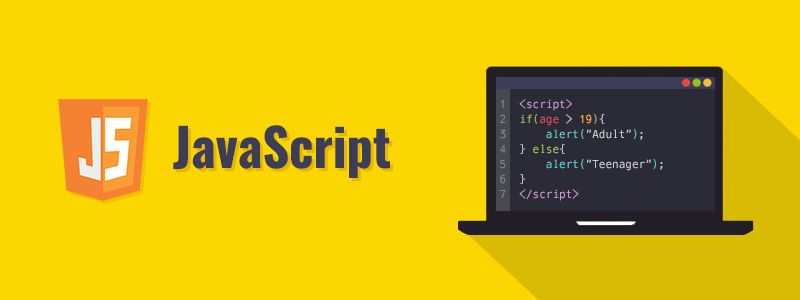

<h1>Desafio 30 dias de código com JavaScript</h1>

Repositório para Desenvolvimento do Desafio 30 dias com JavaScript

<center></center>

Seja muito Bem Vindx!!

Reposítório criado para o desenvolvimento do Desafio 30 dias com Javascript.

Vamos fazer um código de JavaScript por dia e relembrar o que aprendemos lá no início e reforçar o que aprendemos até aqui.

Nível: Inciante
Ferramentas necessárias:
1. Um editor de código. Uso o Visual Studio Code;
2. Node.JS;
3. Git Bash. Caso não queira podes usar o [repl.it](https://repl.it/)

**Quer contribuir?**
1. Faça um clone para sua máquina;
2. Envia a PR da sua contribuição;
3. Adiciona teu perfil na pasta Contribuitors. Abre um arquivo md com o seu nome, dentro da pasta e adiciona as informações segundo o modelo do meu perfil que está lá. 


<h2>Vamos lá!!!!</h2>

```
Dia 01 - Declare uma mensagem!
Dia 02 - Função sem retorno e sem parâmetro
Dia 03 - Função sem retorno, com parâmetro
Dia 04 - Função com retorno, sem parâmetro
Dia 05 - Função com mais de um parâmetro
Dia 06 - Use a Arrow function
Dia 07 - Faça uma IIFE (Função Imediata)
Dia 08 - Faça uma Tabuada
Dia 09 - Função com input
Dia 10 - Use o Template String
Dia 11 - Plote uma tabela no console
Dia 12 - Faça um loop
Dia 13 - Use uma condição
Dia 14 - Vamos à feira com a Joana?
Dia 15 - Um Array de objetos
Dia 16 - Atribua um novo valor
Dia 17 - Use o MAP
Dia 18 - Use o FILTER
Dia 19 - Use o FOR Each
Dia 20 - Vamos fazer uma árvore genealógica?
Dia 21 - 
Dia 22 -
Dia 23 -
Dia 24 - 
Dia 25 - Use o método GET
Dia 26 - Use o método POST
Dia 27 - Use o método DELETE
Dia 28 - Use o método PUT
Dia 29 - Use o método DELETE
Dia 30 - Que dia é hoje?

```


